# WhatsAppWeb

## Kullanılan Teknolojiler

- SignalR
- Onion Architecture CQRS Pattern
- .Net 6
- EntityFrameworkCore
- Mssql
- WebApi
- Automapper
- FluentValidation
- MediatR
- *DependencyInjections*

## Kullanılan Kaynaklar

- Gençay Yıldız https://www.youtube.com/playlist?list=PLQVXoXFVVtp3RSycdru4WpnfPEOFxONiX

## Ekran Görüntüleri

**Register**  
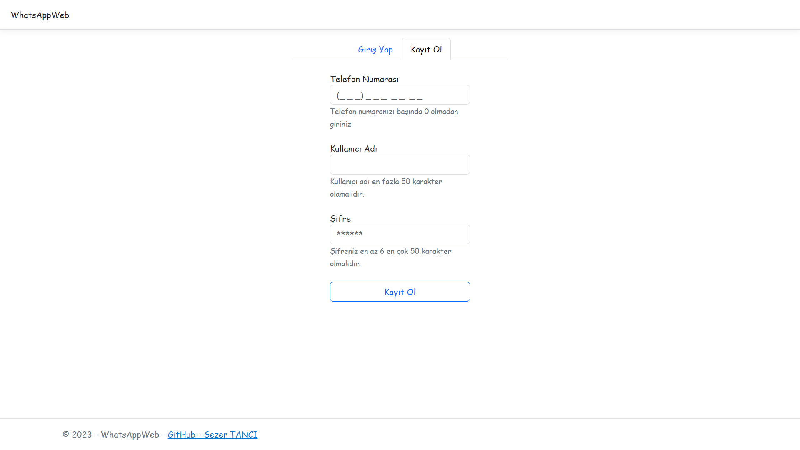 

**Login**  
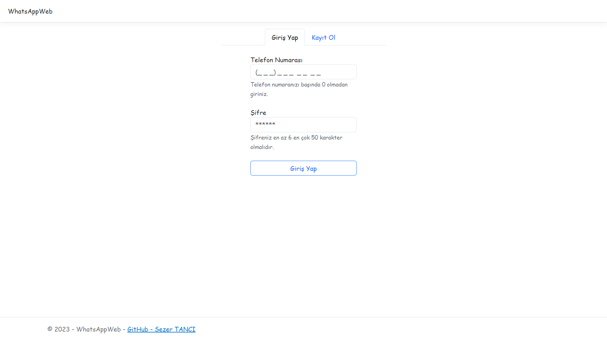 

**Kayıt Sonrası**  
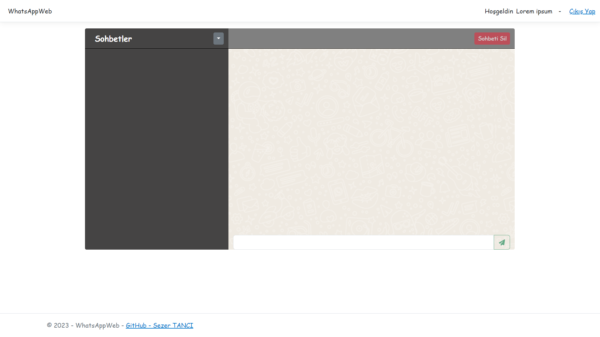

**Menü**  
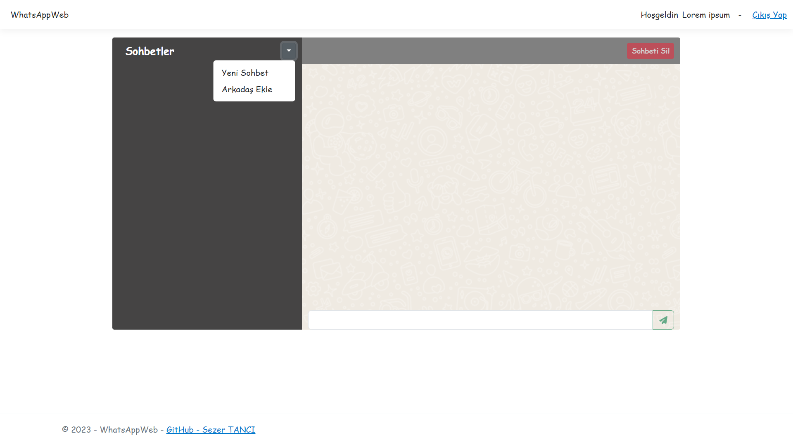 

**Sohbet Başlatma Uyarısı**  
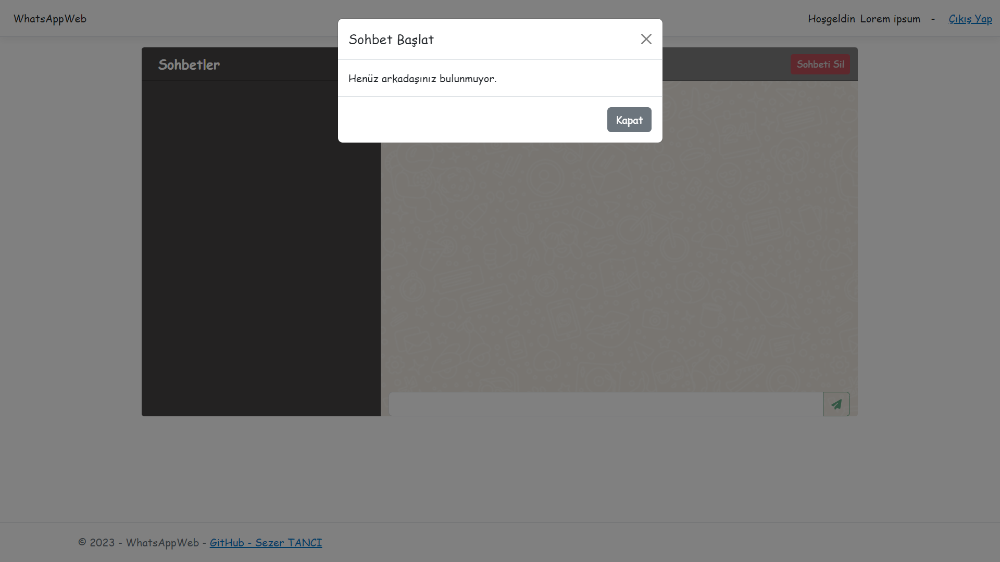

**Arkadaş Ekleme**  
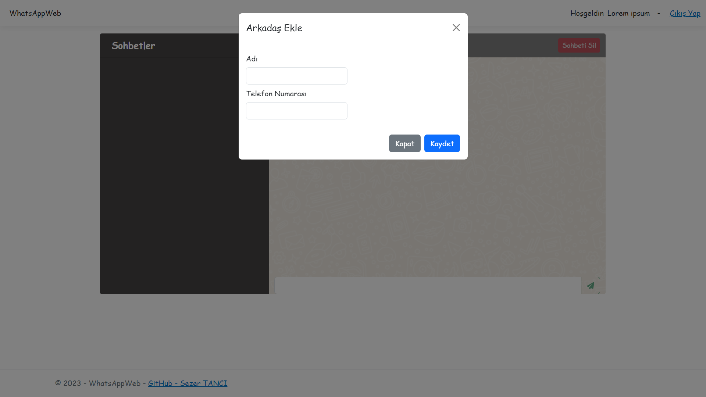

**Sohbet Başlatma**  
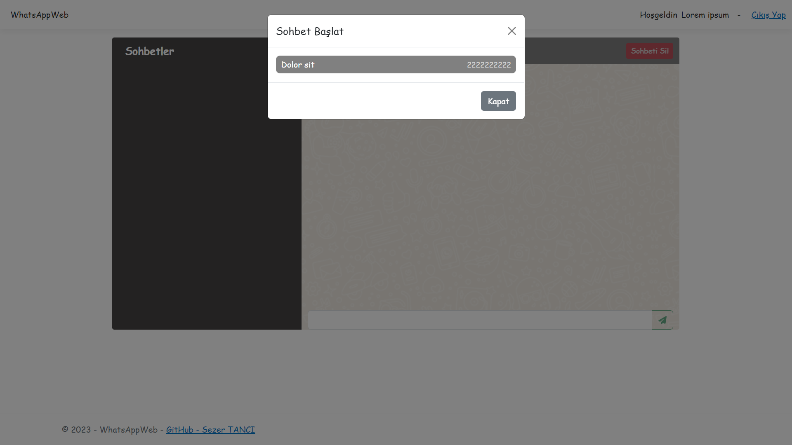

**Sohbet Edilecek Arkadaşın Kullanıcı Olmamsı Uyarısı**  
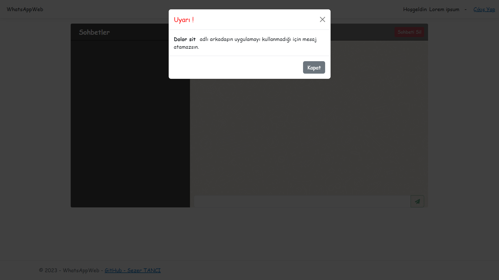

**Mesajlaşma** (Kullanıcı adları ile arkadaş adları farklı olabilir, temel alınan telefon numarasıdır. Mesaj okundu tiki ve son mesaja gitme butonu bulunuyor. Arkadaşı olmayan birinden mesaj gelirse isminin başında '~' işareti görünür.) 
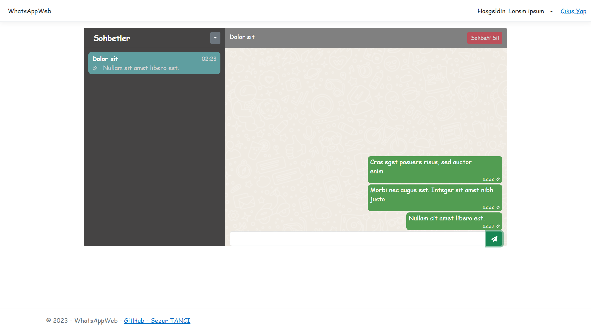
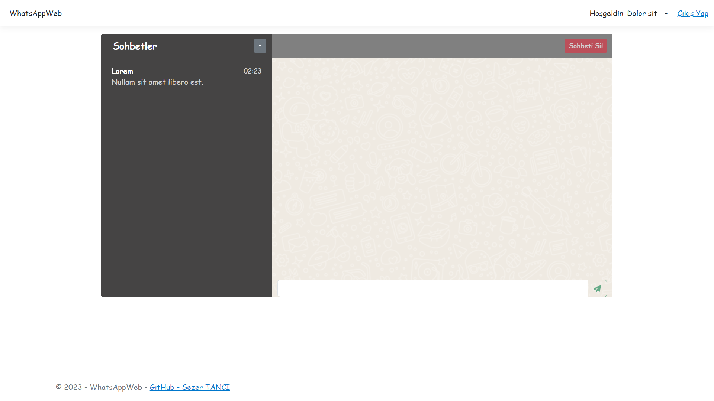
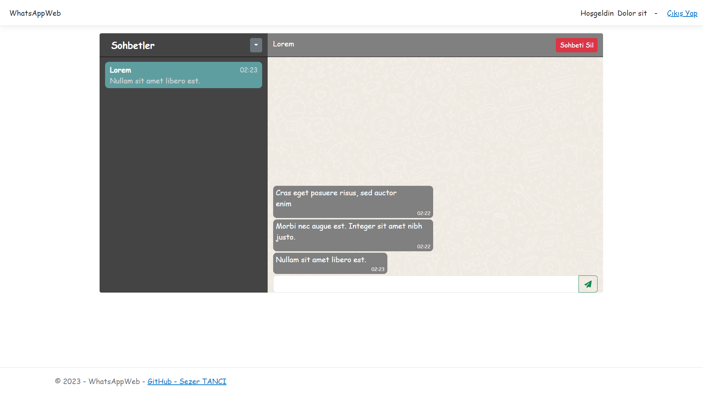
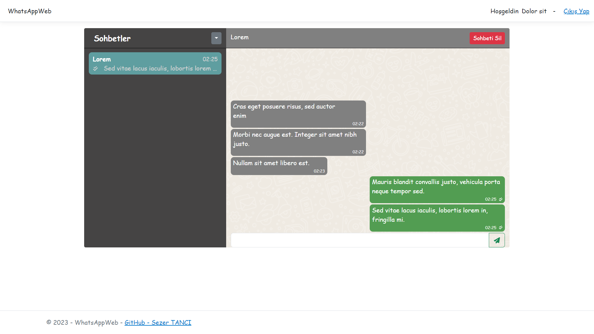
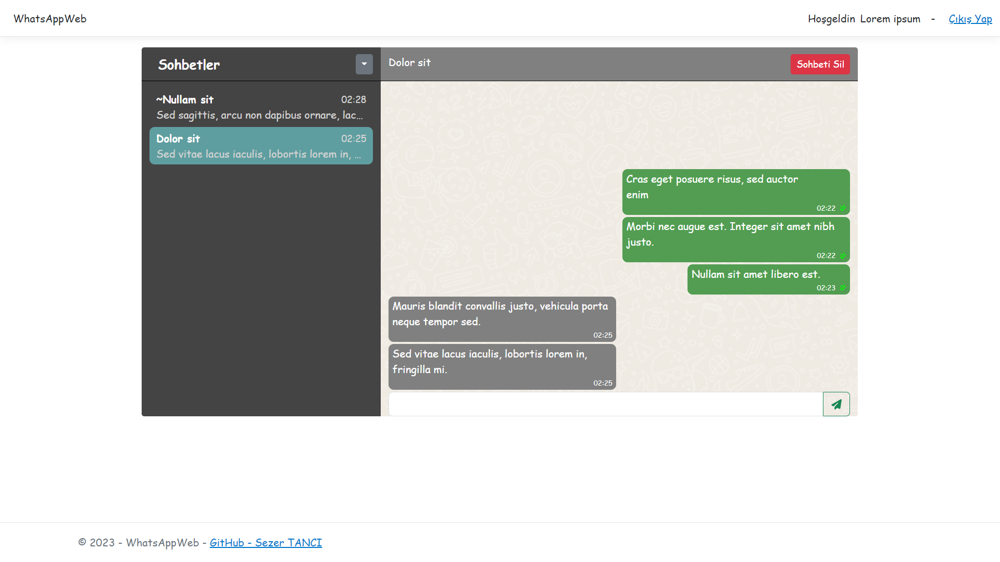
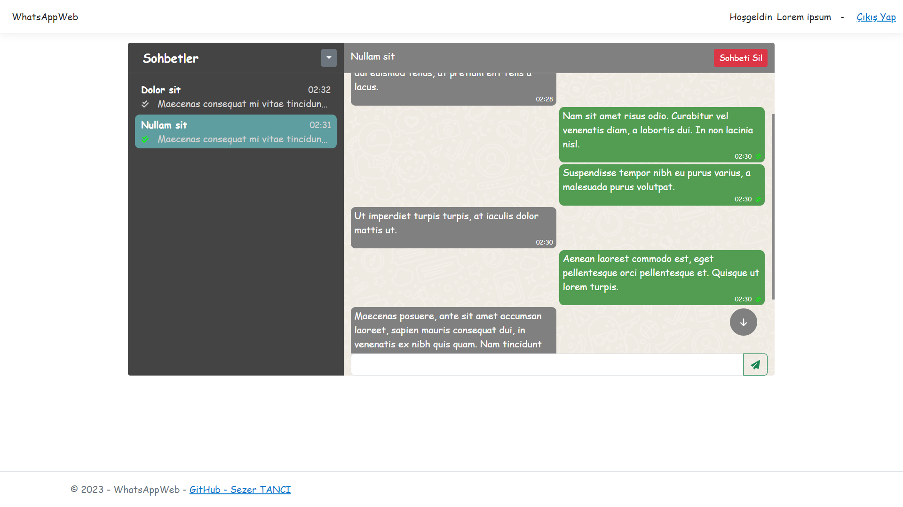
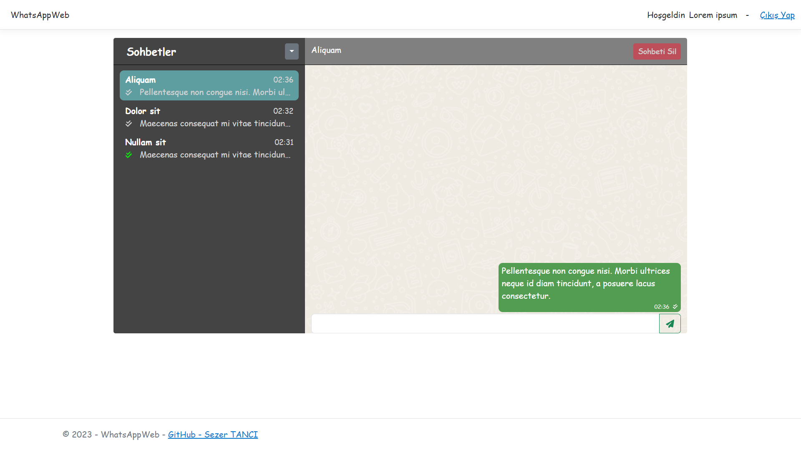
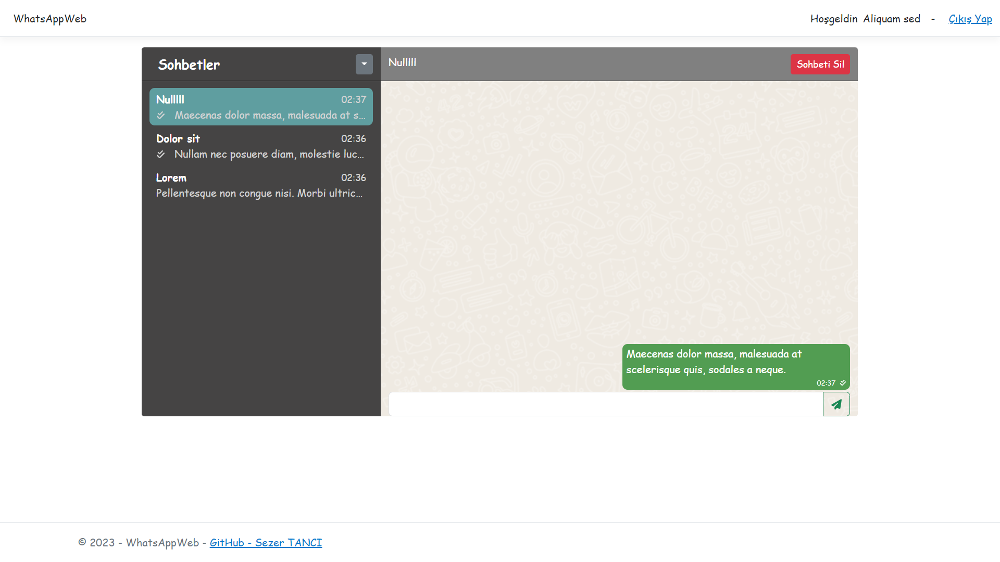
